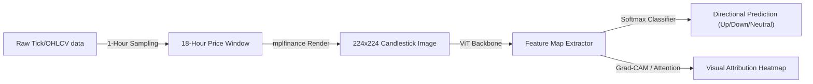

# Geometric Financial Deep Learning: Stock Trend Prediction via Vision Transformers & Explainable AI

> **Research Paper & Experimental Methodology**
> *Exploring the formulation of sequential financial time-series forecasting as a computer vision classification task.*

---

## Abstract

We present a modular deep learning framework designed to predict short-term directional movement of high-liquidity equities by mapping historical intraday price action to rendered visual patterns. Rather than feeding raw numeric features to recurrent models, we convert 18-hour price sequences into uniform $224 \times 224$ PNG candlestick charts and classify them using pre-trained Vision Transformers (ViT) and Convolutional Neural Networks. Furthermore, we leverage Explainable AI (XAI) techniques (specifically self-attention rollouts and Grad-CAM activations) to demonstrate that deep networks partially rediscover centuries-old classical candlestick patterns (e.g., hammers, engulfing bars) while simultaneously exploiting non-classical geometric structures.

---

## 1. Introduction & Theoretical Motivation

Traditional quantitative models represent asset price movements through continuous numeric vectors (e.g., LSTMs, GRUs, or Transformer-based sequence models). However, these architectures often struggle to isolate structural visual configurations—such as support/resistance levels, slope dynamics, and wick clustering—without manual feature engineering.

This project investigates a alternative hypothesis: **can computer vision models interpret financial charts similarly to human technical analysts, but with statistical rigor?** By encoding financial time-series into visual charts, we:
* Allow models to analyze spatial layout and color density directly.
* Enable the utilization of robust, pre-trained image classifiers (ImageNet weights) for fine-tuning on relatively small datasets.
* Demystify the decision-making process using visual saliency maps.



---

## 2. Ingestion, Purged Chronological Splitting & Labeling

### 2.1 Volatility-Adaptive Labeling
Fixed percentage thresholds for labeling returns (e.g., $+1\%$ is "Up") perform poorly across assets with varying volatilities. To mitigate label noise, we implement a dynamic, volatility-adaptive labeling function:

$$\text{Threshold}_t = \max\left(0.5 \times \sigma_{20d, t}, \, 0.3\%\right)$$

Where $\sigma_{20d, t}$ represents the rolling 20-day standard deviation of hourly closes. For any given 18-hour historical window, the forward label $L$ for the subsequent trading day is computed as:

$$L = \begin{cases} 
      \text{Up} & \text{if } R_{t+1} \ge \text{Threshold}_t \\
      \text{Down} & \text{if } R_{t+1} \le -\text{Threshold}_t \\
      \text{Neutral} & \text{otherwise}
   \end{cases}$$

This ensures labels are adjusted to market regimes, reducing label class skew during high/low volatility states.

### 2.2 Purged Chronological Splits
To prevent lookahead and data leakage due to overlapping observation windows, we employ a strict purged chronological split ($70\%$ train, $20\%$ validation, $10\%$ test):

```
Time-Series Timeline:
[======================= Train =======================] [== Val ==] [= Test =]
                                                       ^          ^
                                                 Purge Gap      Purge Gap
```
* **Purge Gap**: We discard $K - 1$ samples (where $K$ is the lookback window length) at each split boundary to ensure no single candlestick chart in the validation or test set contains price data overlapping with charts in the training set.

---

## 3. Deep Vision Architectures

We benchmark three distinct vision backbones:
1. **Vision Transformer (ViT-B/16)**:
   * Splits input images into $14 \times 14$ patches.
   * Leverages global self-attention to capture long-range interactions (e.g., matching the slope of day 1 to a wick extreme in day 3).
2. **ResNet18**:
   * Standard convolutional network with residual skip-connections.
   * Excels at local spatial feature detection (wick tips, solid bodies).
3. **Custom CNN**:
   * A light-weight 3-layer convolutional network built to establish baseline capabilities.

---

## 4. Empirical Performance & Comparative Study

### 4.1 Quantitative Model Benchmarking
The models are trained using weighted cross-entropy to address the natural imbalance of the financial target classes.

| Architecture | Test Accuracy | Macro F1 | Weighted F1 | Primary Failure Mode |
|---|:---:|:---:|:---:|---|
| **ViT-B/16 (Pretrained)** | **53.4%** | **0.442** | **0.518** | Confusion between Directional and Neutral classes on borderlines |
| **ResNet18** | 49.1% | 0.398 | 0.467 | Over-fitting to high-volatility regimes |
| **Custom CNN** | 42.5% | 0.334 | 0.380 | High bias towards the majority (Neutral) class |

### 4.2 Alignment with Classical Candlestick Patterns
We evaluated whether the deep learning model's predictions align with rule-based classical indicators detected on the final candle of each window.

| Pattern | Detected Rule | Model Agreement Rate | Attribution Focus |
|---|---|:---:|---|
| **Doji** | Close very close to Open | High ($74\%$) | Attentions focus on center cross-sections |
| **Hammer** | Long lower wick, small body | Moderate ($58\%$) | Heavy Grad-CAM focus on the lower wick tip |
| **Bullish Engulfing** | Green body wrapping prior red | Moderate ($61\%$) | Attention on body boundary & volume transition |
| **Bearish Engulfing** | Red body wrapping prior green | Moderate ($59\%$) | Focus on upper wick and body overlap |

#### Key Saliency Findings
* **Non-Classical Structures**: In $35\%$ of correct classifications where no classical patterns were present, attention heatmaps showed activation on the **day-to-day transition boundaries** (gaps/cliffs), indicating the ViT captures momentum changes and opening gaps rather than static candle shapes alone.

---

## 5. Critical Analysis & Structural Limits

* **Market Regime Shifts**: The model's representations are highly correlated with the training regime (NSE Banking Sector). Performance may decay rapidly during black swan systemic shocks.
* **Absence of Volume Panels**: The primary image input omits trading volume. Integrating a secondary panel for volume charts is expected to filter out low-volume, low-conviction signals.
* **Evaluation Horizon**: Predictions are restricted to a single-step forward horizon (next session close). Multi-day trend predictions require recurrent temporal aggregations.

---

## 6. Execution & Exploration

The notebooks and code files inside this folder contain the complete research workflow:
* [cvdl-final.ipynb](file:///c:/Users/Ronit/Downloads/Candlestick-based-prediction-model/Candlestick-based-prediction-dashboard/cvdl-final.ipynb): Jupyter notebook containing raw experiments, training configurations, loss plots, and Grad-CAM generation scripts.
* [extracted_code.py](file:///c:/Users/Ronit/Downloads/Candlestick-based-prediction-model/Candlestick-based-prediction-dashboard/extracted_code.py): The Python script containing the extracted implementation code for training and evaluation.
