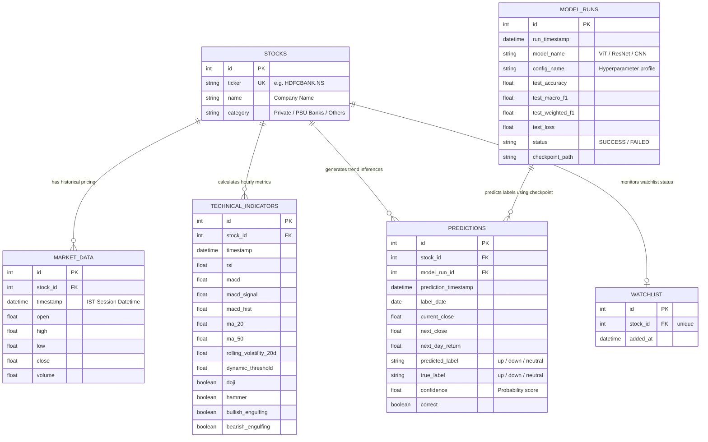

# MarketPulse - Financial Market Analytics & Prediction Platform

MarketPulse is a production-grade Financial Market Analytics and Stock Trend Prediction platform designed to demonstrate modern software engineering, data pipeline modeling, explainable AI, and REST API architectures in fintech applications.

The platform transforms a ViT (Vision Transformer) research pipeline into an enterprise analytical system tracking 15 stock tickers across public and private banks.

---

## 🏛️ System Architecture

The following block diagram represents the modular components of MarketPulse, showing how data streams from extraction (Yahoo Finance) to the database layer, ML prediction, API, and the Streamlit frontend.

```mermaid
graph TD
    subgraph Data Extraction & Validation (ETL)
        YF[Yahoo Finance API] -->|Raw Prices| ETL[Ingestion Pipeline]
        ETL -->|Validation Rules| DQ[Data Quality Validator]
    end

    subgraph Relational Persistence (DB)
        DQ -->|Clean Bulk Inserts| DB[(PostgreSQL / SQLite)]
    end

    subgraph Machine Learning Service (ML)
        DB -->|Hourly Price Series| IMG[Candlestick Renderer]
        IMG -->|18-Candle Images| ViT[Vision Transformer Model]
        ViT -->|Inference Scores| XAI[Grad-CAM Attention Maps]
    end

    subgraph Backend Gateways (REST)
        DB -->|ORM / SQL Queries| API[FastAPI Server]
        XAI -->|Visual Overlays| API
    end

    subgraph Presentation & UI (Dashboard)
        API -->|JSON Endpoints| SL[Streamlit Web Dashboard]
        SL -->|PDF / Excel Downloads| User[Financial Analysts]
    end
```

---

## 🛢️ Database ER Diagram (Entity Relationship)

Below is the normalized relational schema mapping the tracked indices, hourly candles, computed metrics, and inference outputs:



---

## 🚀 Installation & Running Locally

Ensure Python 3.11 is installed on your system.

### Option A: Local Python Environment
1. **Clone the repository and locate `MarketPulse/`**:
   ```bash
   cd MarketPulse
   ```
2. **Install Dependencies**:
   ```bash
   pip install -r requirements.txt
   ```
3. **Initialize Database & Seed Stocks Table**:
   ```bash
   python database/init_db.py
   ```
4. **Ingest Market Data via ETL Pipeline**:
   ```bash
   python etl/pipeline.py
   ```
5. **Start FastAPI Backend Server**:
   ```bash
   uvicorn backend.main:app --reload --port 8000
   ```
6. **Launch Streamlit Dashboard Web Application**:
   ```bash
   streamlit run dashboard/main.py
   ```

### Option B: Containerized Orchestration (Docker Compose)
To compile the images and run the full stack (FastAPI, Streamlit, and PostgreSQL DB) inside Docker:
```bash
docker-compose up --build
```
- Open Swagger documentation at: `http://localhost:8000/docs`
- Open Streamlit Dashboard at: `http://localhost:8501`

---

## 🔌 API Documentation

| Method | Endpoint | Description |
| :--- | :--- | :--- |
| **GET** | `/stocks` | Returns all symbols and categories. |
| **GET** | `/stock/{symbol}` | Returns historical pricing candles. |
| **GET** | `/technical/{symbol}` | Returns computed moving averages, RSI, MACD, and candle pattern triggers. |
| **GET** | `/predictions` | Returns list of Deep Learning predictions and confidence metrics. |
| **GET** | `/analytics` | Runs SQL analytics queries (top gainers/losers, breadth, volume). |
| **GET** | `/performance` | Returns accuracy metrics and training checkpoint registries. |
| **GET** | `/quality` | Returns data quality reports (success rates, validation failures). |
| **POST** | `/refresh` | Asynchronously launches the ETL background task to fetch new stock prices. |

---

## 🔮 Future Enhancements

1. **Incremental Ingestion Sorter**: Implement change data capture (CDC) or a streaming message queue (Kafka) for ticks instead of batch hourly polls.
2. **Dynamic Explainability (LIME/SHAP)**: Supplement Grad-CAM with tabular text explainability showing which technical indicator values contributed to the directional classification.
3. **Enterprise Authentication**: Secure API routes using OAuth2 with JWT tokens and user role management.
