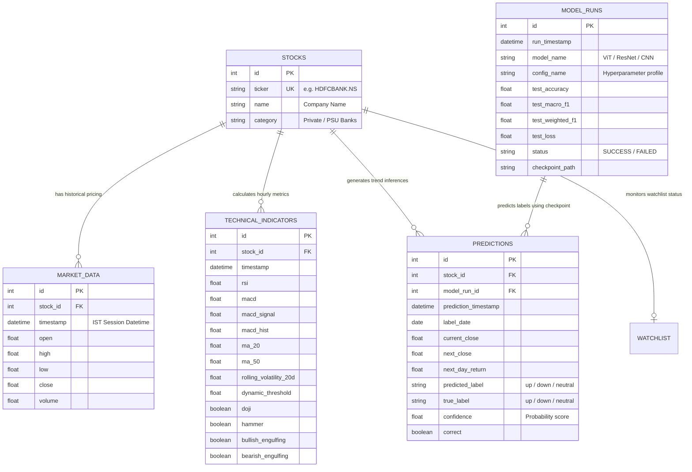

# 📈 Candlestick Stock Trend Prediction Dashboard & MarketPulse Analytics

An end-to-end institutional-grade financial analytics and stock trend prediction system. The platform transforms a **Vision Transformer (ViT)** deep learning research pipeline—which frames short-term stock price forecasting as image classification on rendered candlestick charts—into a containerized production application featuring a **FastAPI** backend, a **PostgreSQL/SQLite** relational database, and an interactive **Streamlit** dashboard.

---

## 🏛️ System Architecture & Workflow

The platform consists of two main pillars:
1. **The Deep Learning Pipeline (`Candlestick-based-prediction-dashboard`)**: Downloads raw intraday price data, transforms temporal series windows into normalized 224×224 image assets, trains/evaluates vision models, and computes Explainable AI (XAI) heatmaps.
2. **The Production Application (`MarketPulse`)**: Orchestrates data ingestion, runs validation checks, stores relational data, serves REST API gateways, and displays visual predictions and indicators to analysts.

### Workflow & Ingestion Pipeline
```mermaid
flowchart TD
    subgraph Data Extraction & ETL
        YF[yfinance API] -->|Raw 1-Hour Bar Data| Ingest[Ingestion Pipeline]
        Ingest -->|Schema & Missing Data Check| DQ[Data Quality Validator]
    end

    subgraph Relational Database (Persistence)
        DQ -->|Clean Bulk Inserts| DB[(PostgreSQL / SQLite)]
    end

    subgraph Machine Learning Service (ML)
        DB -->|Hourly Price Windows| Render[Candlestick Chart Renderer]
        Render -->|224x224 PNG Images| Splits[Purged Chronological Splitting]
        Splits -->|Training / Validation / Test Sets| Models[Model Architecture: ViT / ResNet / CNN]
        Models -->|Inference & Confidence Scoring| Predictions[Predicted Trend: Up / Down / Neutral]
        Models -->|Explainability| XAI[XAI: Grad-CAM & Attention Maps]
    end

    subgraph Backend Gateways (REST API)
        DB -->|ORM & Raw SQL Queries| API[FastAPI Server]
        Predictions -->|Model Evaluation Metrics| API
        XAI -->|Visual Overlays & Attributions| API
    end

    subgraph Presentation & UI (Dashboard Client)
        API -->|JSON Endpoints| SL[Streamlit Web Dashboard]
        SL -->|Financial Reports| User[Analysts & Traders]
    end
```

---

## 📂 Repository Directory Structure

```directory
.
├── Candlestick-based-prediction-dashboard/    # Deep Learning Research & Core Pipeline
│   ├── cvdl-final.ipynb                       # Jupyter Notebook for model training & XAI
│   ├── extracted_code.py                      # Extracted python code of the notebook
│   └── README.md                              # Research report & findings
├── MarketPulse/                               # Production Application Suite
│   ├── backend/                               # FastAPI endpoints, schemas, and main app
│   ├── dashboard/                             # Streamlit dashboard pages & styles
│   ├── data/                                  # Local volume for database and model files
│   ├── database/                              # Database initialization, schemas, and seeds
│   ├── docker/                                # Dockerfiles for deployment
│   ├── etl/                                   # Ingestion pipelines & data quality checks
│   ├── ml/                                    # ML dataset loaders, models, and inference
│   ├── reports/                               # Exporter for analytics reports (PDF/Excel)
│   ├── sql/                                   # SQL analytics queries and metrics
│   ├── tests/                                 # Unit & integration tests
│   ├── config.py                              # Application configuration
│   ├── requirements.txt                       # Application requirements
│   └── README.md                              # MarketPulse documentation & API list
├── docker-compose.yml                         # Container orchestration configuration
└── extract_notebook.py                        # Utility script to extract code from Jupyter notebook
```

---

## 🧠 Machine Learning Engine (ViT & XAI)

Instead of using traditional recurrent networks (LSTMs, GRUs) or tabular indicators, this model treats stock price series geometrically by rendering **18-candle windows** (representing 3 days of trading at hourly resolution) into uniform **224×224 PNG images**. 

### Key Characteristics
* **Volatility-Adaptive Labelling**: Labels (`up`, `down`, `neutral`) are determined dynamically based on rolling stock-specific volatility: 
  $$\text{Threshold} = \max(0.5 \times \text{rolling 20d volatility}, 0.3\%)$$
* **Vision Transformer (ViT)**: Utilizes a Vision Transformer backbone initialized with pre-trained ImageNet weights to capture multi-scale structures, slope, and wick geometrics.
* **Explainable AI (XAI)**: Generates attention map visualizations and Grad-CAM activations, overlaying highlights directly onto the candlestick images to reveal which specific wicks, bodies, or day transitions the model focuses on.

---

## ⚡ Setup & Installation

### Option A: Local Python Environment

#### 1. Prerequisites
Ensure you have Python 3.11+ installed.

#### 2. Install Dependencies
```bash
pip install -r MarketPulse/requirements.txt
```

#### 3. Initialize & Seed Database
This initializes the relational database schemas and registers the 15 target banking stocks:
```bash
python MarketPulse/database/init_db.py
```

#### 4. Run the Ingestion Pipeline
Fetch historical price series from `yfinance` and execute data quality rules:
```bash
python MarketPulse/etl/pipeline.py
```

#### 5. Start Backend REST API
Launch the FastAPI server (accessible at `http://localhost:8000`):
```bash
uvicorn MarketPulse.backend.main:app --reload --port 8000
```
*Navigate to `http://localhost:8000/docs` to explore interactive Swagger API documentation.*

#### 6. Start Streamlit Dashboard
Run the frontend web application (accessible at `http://localhost:8501`):
```bash
streamlit run MarketPulse/dashboard/main.py
```

---

### Option B: Docker Compose Orchestration

To run the complete PostgreSQL database, FastAPI backend, and Streamlit frontend in containerized environments:

1. Build and start the container network:
   ```bash
   docker-compose up --build
   ```
2. Once online:
   * **Streamlit Dashboard**: `http://localhost:8501`
   * **FastAPI Web Docs**: `http://localhost:8000/docs`
   * **PostgreSQL Server**: Running on port `5432`

---

## 📊 Database Schema Details

The platform uses a normalized relational schema to persist prices, compute technical indicators, track models, and log inferences:


